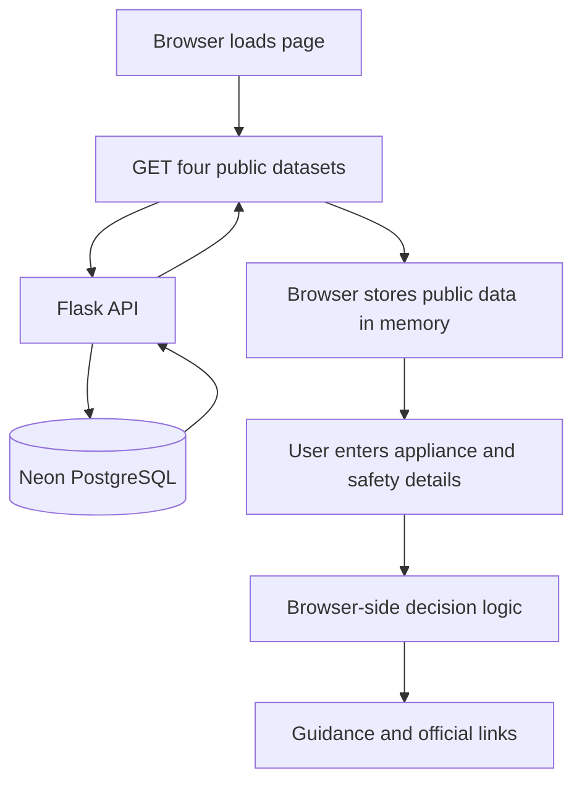

# FixForward backend and integration — learning guide

This guide is for understanding and defending the implementation, not memorising words. Open the referenced files while reading it and explain the logic in your own way.

## 1. The problem we fixed

The old frontend used this rule:

```text
same family + same category = possible recall
```

That was not valid. Thousands of unrelated appliances can share a category. “Heating and simple cooking → Rice cooker” identifies a product type, not a specific product. It cannot prove that all rice cookers are recalled or that this rice cooker is not recalled.

The new rule is:

```text
category narrows candidates
brand optionally narrows candidates
exact structured model identifies a strong possible match
official notice supplies the final verification
```

The word “possible” stays important. A recall notice may apply only to certain serial numbers, manufacture dates, colours or sales periods. A model match is strong evidence, but FixForward is not the legal/official source.

## 2. System flow



The important privacy boundary is between E and C. The server supplies public datasets, but it receives no user journey data. Brand, model, warning answers, area and costs are processed in the browser only.

## 3. Recall decisions

| User input | Program action | User-facing meaning |
|---|---|---|
| Family + category only | Return `insufficient` | More product information is needed |
| Brand only | Filter same-category records by exact normalized brand | Show possible notices, request model |
| Exact model | Compare normalized identifier equality | Strong possible match, verify notice |
| Partial/wrong model | Do not fuzzy-match | No match in the limited data checked |
| API failure | Return `unavailable` | Stop indexed check and use official ACCC search |
| Any serious warning | Safety result takes priority | Stop using; professional/official guidance |

### Identifier normalization

`normalizeIdentifier()` in `src/logic.js`:

1. converts the value to text;
2. applies Unicode NFKC normalization;
3. changes letters to uppercase;
4. removes everything except A–Z and 0–9.

Examples:

| Entered value | Normalized value |
|---|---|
| `BVC 160` | `BVC160` |
| `bvc-160` | `BVC160` |
| ` BVC/160 ` | `BVC160` |
| `BVC` | `BVC`—does not equal `BVC160` |

Why exact equality? Fuzzy matching could incorrectly join similar models such as `ABC100` and `ABC1000`. In a safety feature, avoiding false positives is more important than guessing.

### Matching pseudocode

```text
if recall API is unavailable:
    return unavailable

candidates = reviewed recalls linked to selected UI category

if brand and model are both empty:
    return insufficient

if brand exists:
    candidates = candidates whose normalized brand equals entered brand

if model is empty:
    return insufficient and show candidate notices

matches = candidates with a model/SKU identifier exactly equal to normalized input

if matches exist:
    return strong possible match
else:
    return no match in limited dataset
```

## 4. Why the original `recalls` table is not enough

Dilan's `recalls` table contains 100 useful ACCC RSS notices, but each row mainly has title, summary, URL and search keywords. Brand, product category and model are not guaranteed to be separate, reliable fields. Searching the summary for words can create errors:

- `160` may be power, quantity, phone or model data;
- a category word can appear in safety guidance without describing the recalled product;
- model punctuation varies;
- one notice may contain several models or serial ranges.

Therefore `database/001_i1_recall_matching.sql` adds a reviewed layer:

- `ui_appliance_categories`: stable codes for all nineteen UI categories and links to broader repair categories;
- `recall_products`: the brand/product extracted from one notice and a `manually_reviewed` flag;
- `recall_category_links`: which UI category the reviewed product belongs to;
- `recall_identifiers`: exact model, SKU, serial, barcode or other identifier values.

The API query includes only `manually_reviewed = TRUE`. This prevents raw keywords from silently becoming safety claims.

`database/002_seed_verified_mistral_vacuum.sql` adds one demonstrable record already present in the supplied snapshot: Mistral BVC 160 and BVC 165. The script is idempotent, meaning running it again does not create duplicate rows.

## 5. Data cleaning and transformation logic

Be precise with mentor terminology: Dilan performed the original dataset cleaning/import. This integration adds validation and transformations; it does not claim to re-clean every source file.

| Step | File/function | Reason |
|---|---|---|
| Select relevant database columns | `backend/repository.py` | Avoid exposing internal/unneeded fields |
| Include reviewed recalls only | `reviewed_recall_products()` | Raw RSS text is not reliable exact-match data |
| Use parameters for SQL values | `recall_metadata()` | Prevent SQL injection and separate data from query text |
| Convert dates to ISO | `iso_value()` | Stable browser-readable format such as `2026-06-10` |
| Validate URL scheme/host | `safe_http_url()` | Reject `javascript:` and fake recall domains |
| Drop incomplete identifiers | `build_recall_record()` | A match needs both display and normalized values |
| Group repair barriers | `group_repair_evidence()` | Return each category with its related barriers |
| Calculate unclassified outcomes | same function | `sample - fixed - repairable - end_of_life` |
| Mark missing verification | `build_location()` | Avoid presenting imported providers as verified |
| Map 19 UI categories to 11 evidence buckets | `src/data.js` | The frontend taxonomy is more specific than ORA data |
| Refuse unsupported mapping | portable heater maps to `null` | Better to show insufficient evidence than invent a benchmark |

## 6. Backend file-by-file explanation

### `app.py`

Creates the Flask application object used by Gunicorn. Debug mode is disabled in this entry point.

### `backend/__init__.py`

`create_app()` is an application factory. It builds a fresh app, loads settings, registers API routes, serves only whitelisted frontend assets and adds security headers.

Why whitelist assets? A catch-all static server could accidentally publish `.env`, SQL migrations or Python source.

Why `ProxyFix`? On a hosted service, HTTPS often ends at a reverse proxy. Trusting exactly one proxy lets Flask detect the original secure request and add HSTS correctly.

### `backend/config.py`

Reads `DATABASE_URL`, release version and bounded connection timeout from environment variables. Secrets are configuration, not source code.

### `backend/db.py`

`fetch_all()`:

1. gets the database URL from Flask configuration;
2. opens a Psycopg connection to Neon's pooled endpoint;
3. marks the transaction read-only;
4. executes SQL with separate parameters;
5. returns dictionary-like rows;
6. converts database errors to `DatabaseUnavailable`.

The deployed credential must still be a SELECT-only role. The read-only transaction is a second control, not a replacement for least privilege.

### `backend/repository.py`

Contains SELECT queries only. Keeping SQL here separates data access from HTTP behavior. It joins the structured recall tables and aggregates categories/identifiers into arrays/JSON.

### `backend/transform.py`

Pure functions turn database rows into the public contract. Pure means the result depends only on input and has no database/network side effect, which makes these functions easy to unit test.

### `backend/api.py`

Defines five GET endpoints. It calls the repository, transforms rows and returns JSON. Errors return generic messages so infrastructure details do not leak. API responses use `Cache-Control: no-store` for current mentor testing.

## 7. Frontend integration file-by-file

### `src/config.js`

Enables four same-origin data endpoints. No external API key is needed in the browser.

### `src/data-service.js`

Starts the four GET requests in parallel. It validates the top-level response shapes. If any request fails, it returns the static UI taxonomy/safety questions but empty recall, repair and location arrays.

That is called “fail closed”: uncertainty blocks the safety-related data result instead of using an unsafe old fixture.

### `src/data.js`

Keeps static UI definitions and two mappings:

- display category → stable UI code;
- UI code → broader repair-evidence category.

Public recall/provider/evidence fallback arrays are intentionally empty.

### `src/logic.js`

Holds pure business rules:

- `validateAppliance()` checks the family/category relationship and field lengths;
- `normalizeIdentifier()` prepares exact model comparison;
- `normalizeWords()` prepares brand/suburb comparisons;
- `matchRecall()` implements the decision table;
- `evaluateSafety()` applies Yes > Not sure > No priority;
- `journeyDecision()` decides which paths remain available;
- `parseMoney()` and `compareCosts()` validate and compare user values;
- `getLocations()` filters the downloaded directory locally and returns at most eight rows.

### `src/app.js`

Maintains the temporary journey state and renders screens. It escapes backend text before using `innerHTML`, validates external URLs, never POSTs journey data and preserves recall/safety limitations across later screens.

## 8. Security logic you should understand

| Threat | Control | Remaining limitation |
|---|---|---|
| Credential exposure | Environment secret, `.env` ignored | The already-shared owner credential must be rotated |
| SQL injection | Fixed SELECT queries and parameterized values | Future queries must follow the same rule |
| Database modification | Read-only transaction + required SELECT-only role | Owner URL must not be used by deployed app |
| DOM XSS | Escape backend text; validate URL scheme/host | Continue this for every new dynamic field |
| Malicious/fake recall link | Recall host restricted to Product Safety domain | Users still verify notice content |
| Stale/fake fallback | Empty public-data fallbacks | Outage blocks indexed recall screening |
| Privacy leakage | Public GET endpoints only; local filtering/calculation | Hosting may retain ordinary IP/request logs |
| Information disclosure | Generic API errors; source files not served | Protect hosting logs and dashboards |
| Clickjacking/MIME abuse | CSP, `frame-ancestors`, `X-Frame-Options`, `nosniff` | Verify actual deployed headers |

Never put the Neon connection string in JavaScript. Browser JavaScript is downloaded by every visitor, so anything placed there becomes public.

## 9. How to add another reviewed recall

1. Open the official ACCC notice.
2. Confirm that the row exists in `recalls` and the URL matches.
3. Record brand and product name in `recall_products`.
4. Set `manually_reviewed = true` only after checking the notice.
5. Link the correct UI category in `recall_category_links`.
6. Add each exact model/SKU to `recall_identifiers` with the same uppercase-alphanumeric normalization.
7. Add tests for exact, formatted, partial and wrong-brand cases.
8. Ask a second team member to review the official notice and record evidence.

Do not automate `manually_reviewed = true` from keyword parsing. Automation may suggest candidates, but a person should approve safety-critical identifiers.

## 10. Run and verify locally

```sh
python -m pip install -r requirements.txt
flask --app app run --debug
```

Test endpoints:

```text
http://127.0.0.1:5000/api/health
http://127.0.0.1:5000/api/recalls
http://127.0.0.1:5000/api/sources
http://127.0.0.1:5000/api/repair-evidence
http://127.0.0.1:5000/api/locations
```

Run automation:

```sh
npm run check
python -m unittest discover -s test_backend -v
python -m compileall -q backend app.py
```

The backend tests use fake repository data so they are repeatable and do not change Neon. You still need a manual connected test after running migrations.

## 11. Five-minute mentor demonstration

1. Show `/api/health` and explain that it checks read access.
2. Enter Rice cooker with no brand/model. Point out “insufficient information.”
3. Enter Cleaning → Vacuum cleaner → Mistral → `bvc-160`. Explain normalization and open the official notice.
4. Change model to `BVC`. Show that partial text does not match.
5. Open `/?mock-data-error=1`. Show that an outage blocks indexed screening and does not use a demo record.
6. Demonstrate a Yes safety answer. Explain safety precedence.
7. Search a suburb and state that filtering happens in browser memory; highlight the unverified label.
8. Show tests and the manual release-gate table; do not claim uncompleted gates.

## 12. Likely mentor questions

**Why not match the `match_keywords` column?**  
It mixes product identifiers with dates, power ratings, phone numbers and ordinary words. Exact structured identifiers provide an auditable basis for matching.

**Why is the result still “possible” after an exact model match?**  
The notice can include other conditions such as serial range or sale period. ACCC is the authoritative source.

**Why perform matching in the browser?**  
The dataset is small and public. Browser matching means brand/model never reaches our server. It also avoids creating user journey logs.

**Why use a backend if matching is in the browser?**  
The backend securely reads current public data from PostgreSQL, hides credentials, applies review filters, shapes the contract and adds deployment controls.

**Why not expose all 100 recalls?**  
They are useful discovery records but lack reliably separated brand/model/category fields. Only reviewed structured records support this matching claim.

**How do you stop SQL injection?**  
Routes do not accept query values for these SELECTs, and the one filtered query uses `%s` parameters. The database role is read-only as defence in depth.

**What happens when Neon is down?**  
The API returns a generic 503. The frontend marks recall data unavailable, removes public-data results and links to the official search.

**What is not finished?**  
Credential rotation, running migrations, creating/verifying a SELECT-only role, connected Neon testing, deployed browser/security testing, and adding more reviewed recall identifiers.

## 13. Your next responsibilities

1. Rotate the exposed owner password before any further deployment work.
2. Create a Neon development branch/restore point.
3. Read both SQL scripts line by line, then run them in order.
4. Create a SELECT-only app role using SQL—not Neon's Console Add role action—and test that INSERT fails.
5. Run the app with the new pooled read-only URL.
6. Complete every manual gate in `ACCEPTANCE_RESULTS.md` and save redacted evidence in the PGP.
7. Review and personalize `AI_USE_ACKNOWLEDGEMENT.md`.
8. Update LeanKit cards so completed claims match actual evidence.
