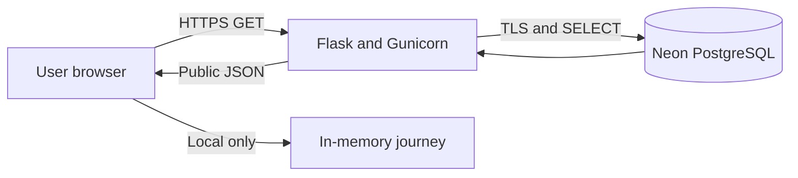

# FixForward Iteration 1 security plan — draft for team review

Status: integrated candidate v1.2.0; connected deployment controls require evidence before approval.  
Owner: `[add security lead]`  
Reviewed by: `[technical mentor]`, `[business mentor]`  
Review date: `[date]`

## 1. Objectives and scope

FixForward must protect the integrity of safety/recall guidance, keep infrastructure credentials confidential, preserve user privacy and remain available enough to fail safely. Iteration 1 includes a public frontend, same-origin read-only Flask API and Neon PostgreSQL public datasets. It excludes accounts, user profiles, uploads, payments, analytics, diagnosis, DIY instructions and POST endpoints.

## 2. Data flow and trust boundaries

Trust boundaries exist at the browser/API connection, API/database connection and hosting administration interface. Brand/model, safety responses, suburb/postcode and costs remain in browser memory and are not request parameters.

## 3. Assets

| Asset | Confidentiality | Integrity | Availability |
|---|---|---|---|
| Database credentials | High | High | Medium |
| Reviewed recall identifiers/links | Public | Critical | High |
| Safety decision rules | Public | Critical | High |
| Repair/location evidence | Public | High | Medium |
| Source provenance/limitations | Public | High | Medium |
| User journey data | Not stored | High | Local-session only |
| Source repository/deployment config | Internal | High | Medium |

## 4. Threat and control register

| ID | Threat | Likelihood/impact | Implemented control | Remaining action |
|---|---|---|---|---|
| R1 | False recall from category matching | Likely/Critical | Category-only returns insufficient; exact structured identifiers only | Add more double-reviewed records |
| R2 | False reassurance after no match | Possible/Critical | Wording says limited dataset and links official search | Usability-test comprehension |
| R3 | Stale/incomplete recall snapshot | Likely/High | Coverage/version/limitations displayed | Define refresh schedule and stale-data alert |
| R4 | Owner credential disclosure | Occurred/High | Secrets excluded from code | Rotate exposed password immediately |
| R5 | Database modification | Possible/High | Read-only transaction design | Deploy only SELECT-role and prove INSERT denial |
| R6 | SQL injection | Unlikely/High | Fixed SELECTs and parameterized values | Review every future query |
| R7 | DOM-based XSS via public data | Possible/High | HTML escaping and URL validation/host restriction | Browser security testing after deployment |
| R8 | Sensitive error disclosure | Possible/Medium | Generic API responses; exception details not returned | Review production logs/access |
| R9 | Clickjacking/content injection | Possible/Medium | CSP, frame denial, nosniff, referrer/permissions policies | Verify deployed headers |
| R10 | API/Neon outage | Possible/High | 503 plus empty fail-closed fallback and official search | Monitor uptime; document incident owner |
| R11 | Misleading provider data | Likely/Medium | Unverified label/contact-before-travel wording | Verify priority providers or use directory links only |
| R12 | Privacy leakage through journey requests | Unlikely/High | GET public datasets only; local filtering/calculation | Confirm access logs contain no journey values |

## 5. Secure development rules

- Never commit or screenshot passwords, full database URLs or tokens.
- Use a development branch and a backup/restore point before migrations.
- Use SELECT-only application credentials and environment variables.
- Keep SQL fixed/parameterized; do not build queries with string concatenation.
- Escape all database text before HTML insertion and validate external links.
- Require a second-person check before `manually_reviewed` becomes true.
- Add a positive, negative, boundary and outage test for each safety rule.
- Keep debug mode off in deployment and do not return stack traces.
- Tag/archive the tested iteration release; continue development separately.

## 6. Privacy and logging

FixForward creates no account and stores no journey. Public API requests contain no appliance, model, warning answer, area or cost. Ordinary hosting/database services may still process IP address, timestamp, user agent and request path for operational logs. Access to those logs should be limited to authorised team/hosting administrators, with retention set only as long as operationally necessary.

## 7. Assessment and test evidence

Automated results are listed in `ACCEPTANCE_RESULTS.md`. Before release, attach:

- secret scan of current files and Git history;
- SELECT-success/INSERT-denied database evidence;
- connected endpoint test evidence;
- malicious-text/URL rendering tests;
- security-header results over deployed HTTPS;
- 404/500/503 behavior;
- mobile/keyboard/usability tests;
- defects, fixes and retest evidence;
- mentor approval/minuted actions.

Testing is authorised only against team-owned development/deployment resources. Do not scan ACCC, Neon or third-party providers beyond ordinary allowed use.

## 8. Incident response

1. Contain: disable the deployment or rotate/revoke the affected secret.
2. Preserve: save timestamps, redacted logs and the deployed version/tag.
3. Assess: determine affected data, guidance and users; do not speculate publicly.
4. Correct: patch code/data, rerun automated and manual regression tests.
5. Communicate: notify the teaching/mentor team and relevant service owner according to unit/project procedures.
6. Recover: redeploy the verified archive and monitor.
7. Learn: record cause, actions and prevention in risks/retrospective.

The technical/security owner handles containment and evidence; the BA/project lead records stakeholder communication, decisions and traceability. Replace these generic roles with actual names.

## 9. Residual risks and release decision

The largest residual risk is incomplete recall coverage: exact matching is only available for manually reviewed identifiers in a recent RSS snapshot. This must remain visible to users. Release approval also depends on credential rotation, migration execution, read-only-role verification, live integration testing and deployed security checks. Until those gates are evidenced, this version is a tested candidate, not a production-approved build.
