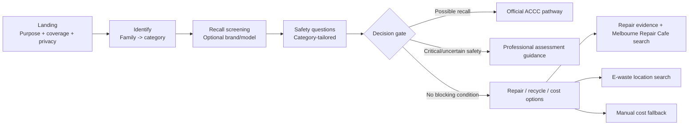

# FixForward Iteration 1 - System Architecture (v1.3 redesign)

## 1. User-facing flow



## 2. Data architecture

```mermaid
flowchart TB
    ACCC[ACCC recall source] --> PIPE[Governed data import / review]
    ORA[Open Repair data] --> PIPE
    VIC[Victorian / Melbourne location datasets] --> PIPE
    PIPE --> NEON[(Neon PostgreSQL\ncurated read model)]
    NEON --> API[Flask read-only API]
    API --> R[/api/recalls]
    API --> S[/api/sources]
    API --> E[/api/repair-evidence]
    API --> L[/api/locations]
    R --> WEB[Browser SPA]
    S --> WEB
    E --> WEB
    L --> WEB
    STATIC[Static family + safety rule definitions] --> WEB
```

## 3. Dataset -> function traceability

| Data | Backend function | Endpoint | Frontend use |
|---|---|---|---|
| Reviewed recall products | `reviewed_recall_products()` | `/api/recalls` | `matchRecall()` / `renderRecall()` |
| Recall metadata | `recall_metadata()` | `/api/recalls` | coverage/limitation wording |
| Data source register | `sources()` | `/api/sources` | grouped Sources dialog |
| Repair statistics | `repair_statistics()` | `/api/repair-evidence` | `repairEvidencePanel()` |
| Repair barriers | `repair_barriers()` | `/api/repair-evidence` | evidence details |
| Relevant locations | `relevant_locations()` | `/api/locations` | `getLocations()` / `renderLocationResults()` |
| Safety definitions | static `data.js` | none | `applicableSafetySigns()` / `evaluateSafety()` |

## 4. Reliability behavior

- Browser renders a loading screen **before** network activity.
- Public datasets load independently using `Promise.allSettled()`.
- Failure of locations does not disable recall.
- Failure of recall does not disable static safety screening.
- The user can retry public data without clearing the assessment.
- `/api/health` is process liveness and no longer depends on Neon.
- `/api/ready` checks database readiness.
- Public data responses allow short caching to reduce repeated Neon reads.

## 5. Iteration boundary

Still out of scope unless formally approved and supported by data/security design:

- accounts and login;
- stored assessment history;
- barcode/OCR/image upload;
- automatic geolocation-to-suburb mapping;
- a verified professional repair-business directory;
- complete Australian recall coverage;
- authoritative automatic market-price benchmarking.
