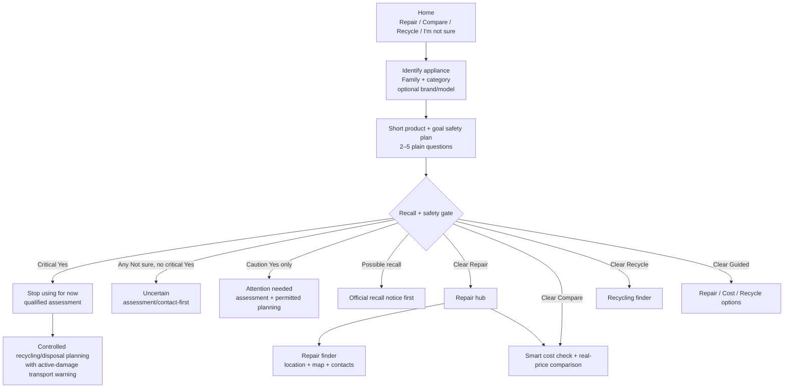
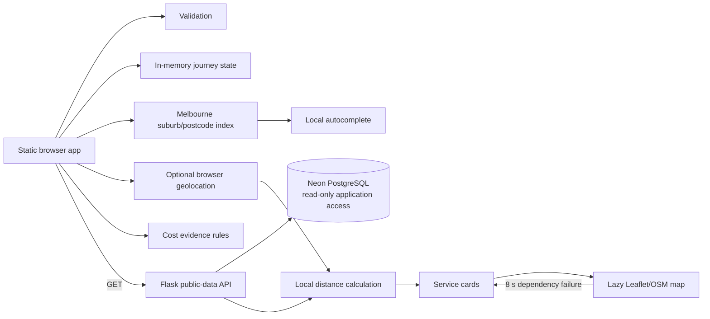
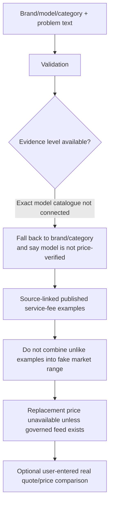

# FixForward Iteration 1 — System Architecture (v1.6 usability-lab prototype)

## 1. User-facing architecture



The interface never labels the appliance “safe”. A clear result means only that the user did not report one of the warning signs asked in that short plan.

## 2. Browser architecture



### Browser-memory data only

The current design keeps the following in JavaScript memory:

- chosen goal;
- appliance family/category/brand/model;
- safety answers;
- user-entered problem description;
- user-entered cost values;
- optional exact device coordinates;
- current filters and selected area.

It does not create a server endpoint to save these journey answers.

## 3. Public-data API

```text
GET /api/health          process liveness; no DB dependency
GET /api/ready           database readiness
GET /api/recalls         reviewed structured recall index
GET /api/sources         provenance/source metadata
GET /api/repair-evidence category-level repair history
GET /api/locations       public repair/recycling location records
```

Each browser dataset is loaded independently. `Promise.allSettled()` prevents one failed endpoint from making all other public data appear unavailable.

## 4. Recall matching

```text
selected category
      +
optional brand/model
      ↓
exact normalised model search within category
      ├─ exact reviewed model → possible recall + official notice
      ├─ near model → re-check label suggestion only
      ├─ no model → insufficient for product-specific result
      └─ no exact match → limited-list no-match, never recall clearance
```

Brand supports the match but cannot hide an exact reviewed model hit. The official Product Safety notice remains authoritative.

## 5. Safety architecture

Question selection is data-driven by:

- `SAFETY_RULES` — severity and explanation;
- `SAFETY_APPLICABILITY` — appliance relevance;
- `CATEGORY_SAFETY_PRIORITY` — appliance-specific order;
- `SAFETY_PLAN_LIMITS` — goal-specific maximum question count.

The state evaluator applies precedence:

```text
critical Yes > any Not sure > caution Yes > clear
```

Not sure **does not stop the questionnaire**. The separate unable-to-check action is the early exit.

## 6. Location architecture

### Manual autocomplete

`src/suburbs.js` contains a generated Melbourne-area suburb/postcode lookup index from the project's cleaned source. Partial typing is resolved locally:

```text
"312" → matching postcode prefixes + suburb names
"rich" → Richmond and other matching suburb names
```

No external geocoding/autocomplete API receives those keystrokes.

### Current location

After explicit browser permission, device latitude/longitude is held in memory and compared with public service coordinates using local distance calculations. No exact coordinate is written to Neon.

### Map

Leaflet + OpenStreetMap is loaded lazily only when useful service results exist. An eight-second timeout prevents a hanging map dependency from blocking the action-oriented service list.

## 7. Cost architecture



The v1.6 browser does not call an AI service. Problem grouping is deterministic. A future AI resolver belongs behind a new reviewed trust boundary and may help find candidate product identities, but price values must remain source-derived.

## 8. Deployment architecture

```text
Browser
  ↓ HTTPS
Render web service
  ├─ Flask static/frontend
  ├─ public-data API
  └─ Gunicorn 2 workers × 2 threads
       ↓ TLS PostgreSQL
Neon
  └─ read-only application access
```

`DATABASE_URL` is environment-injected. It is not committed to source control.

## 9. Availability design

- first landing screen renders from static definitions immediately;
- recall failure does not disable safety;
- location failure does not disable recall/safety/cost;
- map failure does not remove service cards;
- geolocation denial does not remove manual search;
- missing price evidence produces an explicit evidence gap, not a guessed value;
- `/api/health` does not depend on Neon while `/api/ready` does.

## 10. Scope decision needed

This architecture contains experiments beyond older I1 artefacts. Before final acceptance, explicitly decide and record whether to keep:

- goal-first routing;
- geolocation;
- goal-specific safety depth;
- caution-cost planning;
- controlled hazard recycling/disposal planning;
- local postcode/suburb autocomplete;
- smart cost check and its approved data sources.
