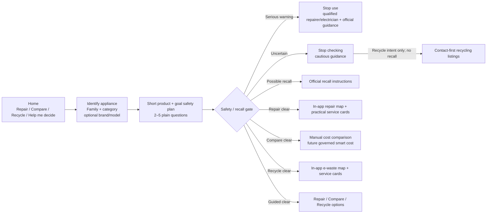

# FixForward Iteration 1 — System Architecture (v1.5 human-first prototype)

## 1. User-facing architecture



The goal selection is **not** a safety bypass. A possible recall or serious warning overrides convenience. A Yes/Not sure answer can end the question sequence early so users are not encouraged to inspect or re-test an appliance.

## 2. Data architecture

```mermaid
flowchart TB
    ACCC[Official recall source] --> PIPE[Controlled import / review]
    ORA[Open Repair Alliance] --> PIPE
    VIC[Victorian waste data] --> PIPE
    OSM[OpenStreetMap-derived repair locations] --> PIPE
    PIPE --> NEON[(Neon PostgreSQL\ncurated read model)]
    NEON --> API[Flask read-only API]
    API --> R[/api/recalls]
    API --> S[/api/sources]
    API --> E[/api/repair-evidence]
    API --> L[/api/locations]
    STATIC[Static families + safety definitions] --> WEB[Browser SPA renders immediately]
    R --> WEB
    S --> WEB
    E --> WEB
    L --> WEB
    GEO[Browser geolocation\npermission on user action] --> LOCAL[Memory-only distance calculation]
    L --> LOCAL
    LOCAL --> MAP[Leaflet map\ncreated only for useful results]
```

**Privacy boundary:** `GEO` never goes to `API` or `NEON` in this prototype.

## 3. Static-first / background-data behavior

```text
HTML + JS + static appliance/safety definitions
                  ↓
          landing renders now
                  ↓
recalls / sources / repair history / locations load independently
                  ↓
available datasets enhance the current screen
```

A cold Render/Neon connection therefore does not blank the landing page. If recall data arrives after a fast user starts, an earlier `unavailable` recall state can be re-evaluated. If location data arrives while the service screen is open, the screen refreshes while preserving typed area text.

## 4. Dataset → function traceability

| Data | Backend | Endpoint | Browser use |
|---|---|---|---|
| Reviewed recall products | `reviewed_recall_products()` | `/api/recalls` | `matchRecall()` / `recallMiniCard()` |
| Recall metadata | `recall_metadata()` | `/api/recalls` | limitation/coverage detail |
| Source register | `sources()` | `/api/sources` | grouped About dialog |
| Repair statistics | `repair_statistics()` | `/api/repair-evidence` | `repairEvidenceSummary()` stacked visual |
| Repair barriers | `repair_barriers()` | `/api/repair-evidence` | expandable evidence detail |
| Relevant locations + coordinates | `relevant_locations()` | `/api/locations` | `getLocations()`, `getNearbyLocations()`, `renderMap()` |
| Static safety rules | `data.js` | none | `applicableSafetySigns()`, `safetyPlanFor()`, `evaluateSafety()` |
| User coordinates | none | **none** | `navigator.geolocation` → `distanceKm()` only |

## 5. Goal/product safety planning

`safetyPlanFor(category, intent, signs)` first removes questions not applicable to the appliance, then applies a category priority and a goal limit.

Current prototype maximums:

| Goal | Max questions |
|---|---:|
| Repair | 4 |
| Compare | 3 |
| Recycle | 2 |
| Help me decide | 5 |

This is a UX prototype decision requiring final BA/safety acceptance. It does not change the rule that severe warning signs override the requested route.

## 6. Reliability behavior

- Useful static landing renders before public-data network work completes.
- Public datasets load independently with `Promise.allSettled()`.
- Location failure does not disable recall.
- Recall failure does not disable static safety questions.
- Public data can be retried without resetting the journey.
- Service cold-start can auto-refresh without clearing typed search text.
- Leaflet/OSM is not loaded until a useful result set exists to plot.
- Map failure leaves the text service list usable.
- `/api/health` checks process liveness.
- `/api/ready` checks database readiness.
- Changing appliance family/category clears stale safety, decision and cost-result state.

## 7. Prototype scope-change flags

Device geolocation, goal-first shortcuts, goal-specific safety depth, early-stop behavior and uncertainty-to-contact-first recycling are not assumed to be final I1 requirements. Record an explicit approve/defer/reject decision before final scope freeze.
