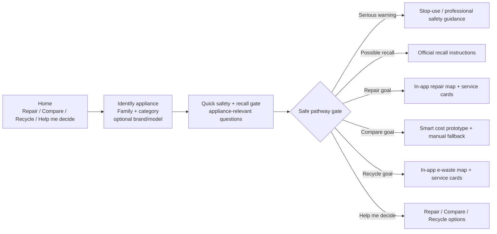

# FixForward Iteration 1 — System Architecture (v1.4 goal-first prototype)

## 1. User-facing architecture



The goal selection is not a safety bypass. Recall/safety rules can override the requested pathway.

## 2. Data architecture

```mermaid
flowchart TB
    ACCC[Official recall source] --> PIPE[Controlled import / review]
    ORA[Open Repair Alliance] --> PIPE
    VIC[Victorian waste data] --> PIPE
    OSM[OpenStreetMap-derived repair locations] --> PIPE
    PIPE --> NEON[(Neon PostgreSQL\ncurated read model)]
    NEON --> API[Flask read-only API]
    API --> R[/api/recalls]
    API --> S[/api/sources]
    API --> E[/api/repair-evidence]
    API --> L[/api/locations]
    R --> WEB[Browser SPA]
    S --> WEB
    E --> WEB
    L --> WEB
    STATIC[Static family + safety rule definitions] --> WEB
    GEO[Browser Geolocation\npermission only] --> LOCAL[Local distance calculation]
    L --> LOCAL
    LOCAL --> MAP[Leaflet map\nOpenStreetMap tiles]
```

**Privacy boundary:** `GEO` never goes to `API` or `NEON`.

## 3. Dataset → function traceability

| Data | Backend | Endpoint | Browser use |
|---|---|---|---|
| Reviewed recall products | `reviewed_recall_products()` | `/api/recalls` | `matchRecall()` / `recallMiniCard()` |
| Recall metadata | `recall_metadata()` | `/api/recalls` | limitation/coverage detail |
| Source register | `sources()` | `/api/sources` | grouped About dialog |
| Repair statistics | `repair_statistics()` | `/api/repair-evidence` | `repairEvidenceSummary()` |
| Repair barriers | `repair_barriers()` | `/api/repair-evidence` | evidence detail |
| Relevant locations + coordinates | `relevant_locations()` | `/api/locations` | `getLocations()`, `getNearbyLocations()`, `renderMap()` |
| Static safety rules | `data.js` | none | `applicableSafetySigns()`, `evaluateSafety()` |
| User coordinates | none | **none** | `navigator.geolocation` → `distanceKm()` only |

## 4. Goal-first routing

```text
selected goal
    ↓
appliance
    ↓
quick safety/recall gate
    ↓
if blocked: safe override
if clear: direct route to requested tool
```

This removes the redundant “choose next action” screen for users who already chose a goal on the landing page.

## 5. Reliability behavior

- Loading UI is rendered before network work.
- Public datasets load independently with `Promise.allSettled()`.
- Location failure does not disable recall.
- Recall failure does not disable static safety questions.
- Public data can be retried without resetting the journey.
- `/api/health` checks process liveness.
- `/api/ready` checks database readiness.
- No user-coordinate network request is required for nearby sorting.

## 6. Prototype scope-change flag

Device geolocation changes the previously documented I1 manual-location boundary. The prototype implements it in the least-data way (browser permission + memory-only coordinates) so the team can usability-test the idea. It must be explicitly accepted or deferred before the final I1 scope is frozen.
