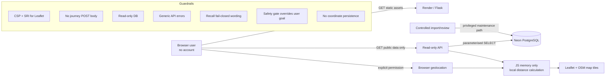

# FixForward Iteration 1 — Secure Architecture (v1.4 prototype)

## Security objective

FixForward has no accounts or payments. The primary security objective is **decision integrity**: a data outage, manipulated state, misleading imported record or convenient UX shortcut must never become false safety reassurance.



## Trust boundaries and controls

| Boundary | Threat / failure | Implemented control | Verify before final release |
|---|---|---|---|
| Browser → API | crafted requests, XSS, bypass | GET-only reference API, escaped dynamic text, CSP | live method/route tests; dependency scan |
| API → Neon | injection, excessive privilege, outage | parameterised SQL, read-only transaction/role design | effective grants; timeout/resilience evidence |
| Imported data → UI | stale/poisoned/misleading rows | curated source pipeline, reviewed recall flag, source metadata, practical “call/check before travelling” wording | import checksums, review evidence, data refresh tests |
| Goal shortcut → safety gate | user bypasses recall/safety | every Repair/Compare/Recycle goal goes through quick gate; serious/uncertain/recall state overrides requested route | E2E direct-route/bypass tests |
| Device geolocation | privacy leakage | permission only on click; coordinates stored in JS state only; no coordinate API request or persistence | browser network/storage inspection |
| External map dependencies | supply-chain / availability | Leaflet 1.9.4 pinned with official SRI hashes; CSP allowlist; OSM attribution; `strict-origin-when-cross-origin` permits the origin Referer expected by OSM; list works without map | CDN outage test; review OSM tile usage for production |
| External links | malicious redirect | HTTP(S) validation; recall notice host allowlist in backend | audit service/source URLs |
| Cost intelligence | hallucinated/biased price | no automatic dollar value without governed evidence; AI only proposed for identity resolution | price-source governance and model evaluation before activation |
| Hosting/logging | privacy overclaim | UI says hosting may process normal technical logs; no analytics cookies | document Render retention/access controls |

## Geolocation privacy data flow

```text
User clicks "Use my current location"
            ↓
Browser permission dialog
            ↓
latitude/longitude in JS memory
            ↓
Haversine comparison with public service coordinates
            ↓
nearest results + map

NO POST → Flask
NO write → Neon
NO localStorage/cookie
```

The geolocation feature is a **prototype scope change** and needs BA/mentor/security approval before final-I1 inclusion because the earlier baseline specified manual suburb selection only. The exact coordinate is not sent to FixForward/Neon, but viewing a map necessarily causes the browser to request map tiles for the displayed area from OpenStreetMap; this third-party disclosure must be included in the privacy review.

## Safe-failure rules

1. Recall endpoint unavailable → state that the check is unavailable; official search remains available; static safety check still works.
2. Location endpoint unavailable → recall/safety/cost logic continues.
3. Map/CDN unavailable → service text list remains usable.
4. Geolocation denied/unavailable → manual suburb/postcode remains usable.
5. Serious or uncertain safety result → no community Repair Café and no cost shortcut.
6. Possible recall → official recall instructions take priority.
7. Near model identifier → never promoted to exact recall match.
8. No location match → never invent a provider.
9. Missing phone/hours/photo/acceptance evidence → do not invent it.
10. Weak price data → do not generate an automatic market price.
