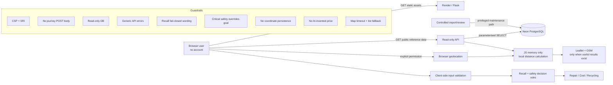

# FixForward Iteration 1 — Secure Architecture (v1.6 usability-lab prototype)

## Security objective

FixForward has no accounts, payments or private uploads in Iteration 1. Its primary security objective is **decision integrity**: outages, malformed input, stale data, manipulated state or a convenient shortcut must never turn into false reassurance about an appliance.



## Trust boundaries and controls

| Boundary | Threat / failure | v1.6 control | Evidence still required before final release |
|---|---|---|---|
| Browser → API | crafted requests, XSS, unsupported methods | GET-only public reference API, escaped dynamic text, CSP | live method/route tests; dependency review |
| API → Neon | injection, excessive privilege, database outage | parameterised SQL, read-only transaction/role design, bounded connect timeout | effective grants and Neon-role evidence |
| Imported data → UI | stale/poisoned/misleading data | reviewed recall flag, source metadata, conservative wording, contact/check-before-travel | import hashes/review records/refresh evidence |
| Goal shortcut → safety | user bypasses warning logic | every direct goal passes through a product-specific safety/recall gate | E2E direct-route bypass attempts |
| Safety questionnaire | user encouraged to test dangerous device | simple examples say not to turn on/open/touch/test; Not sure is accepted; separate unable-to-check route | human usability observations + content review |
| Safety state → action | mixed answers hide danger | **any critical Yes wins**, regardless of other No/Not sure answers | regression tests + manual scenarios |
| Device geolocation | exact-location privacy leakage | permission only on click; coordinates in JS memory; no coordinate POST/write | DevTools network/storage capture |
| Suburb autocomplete | injection/oversized/gibberish input | max length, restricted validation, dataset-derived escaped options, keyboard ARIA state | accessibility/browser testing |
| External map dependency | supply-chain/privacy/availability | pinned Leaflet 1.9.4 + SRI, CSP allowlist, OSM attribution, lazy load, eight-second timeout, usable list fallback | CDN failure test + traffic/policy review |
| External links | malicious redirect | HTTP(S) validation; official recall host restriction in backend | URL audit |
| Cost helper | fake price / model hallucination | user-entered model is not price-verified; different provider fees shown separately; no replacement price without governed feed; AI not connected | approved data/API + model-evaluation gate |
| Manual costs | malformed/huge values | positive numeric parser, max two decimals, AUD 100,000 sanity cap, field errors | boundary tests |
| State changes | stale result belongs to old appliance | family/category/brand/model changes invalidate downstream safety/cost/result state | Back/edit/re-run tests |
| Hosting/logging | sensitive logs/privacy overclaim | no analytics storage by app; infrastructure-aware privacy copy; unexpected API handler logs generic class/path without deliberate traceback attachment | Render retention/access-control evidence |

## Geolocation privacy data flow

```text
User selects "Use my current location"
             ↓
Browser permission dialog
             ↓
latitude/longitude in JS memory
             ↓
Haversine comparison with public service coordinates
             ↓
nearest/radius-filtered results
             ↓
map resources loaded only when results are worth plotting

NO journey POST → Flask
NO coordinate write → Neon
NO localStorage / sessionStorage / cookie journey state
```

The browser/map provider can still receive ordinary network metadata and map-area requests. FixForward must not claim “no one ever receives any location-related information.”

## Safety state machine

```text
All selected questions answered
          ↓
critical Yes present? ── yes ──> HIGH / STOP USE
          │                         ├─ no ordinary cost
          │                         ├─ no community Repair Cafe
          │                         └─ controlled disposal planning allowed with transport warning
          no
          ↓
any Not sure? ─────── yes ──> UNCERTAIN
          │                      ├─ no ordinary community Repair Cafe
          │                      ├─ no normal cost shortcut
          │                      └─ assessment/contact-first pathways
          no
          ↓
caution Yes? ─────── yes ──> CAUTION
          │                    ├─ get-it-checked wording
          │                    ├─ cost planning can remain visible if no recall
          │                    └─ community Repair Cafe blocked
          no
          ↓
CLEAR-TO-OPTIONS (never labelled "safe")
```

**Important:** answering **Not sure does not stop the remaining questions**. The user can continue using what they already know. Only the separate **I'm not able to check this safely** action short-circuits the questionnaire to a cautious/uncertain result.

## Recall precedence

1. Exact reviewed model can produce a **possible recall match**, never “confirmed recalled”.
2. Near/one-character-different model remains a suggestion only.
3. No match in the limited index never means recall-free.
4. Recall endpoint failure never becomes no-match.
5. A possible recall directs the user to the official notice before ordinary repair/cost/recycling choices.
6. A critical safety warning remains visible even when a recall is also possible.

## Hazard disposal planning

A user with a serious warning may still need to know how to dispose of the item. v1.6 therefore allows a controlled recycling/disposal information route rather than an unusable dead end.

It must state that the user should **not transport** an appliance that is hot, smoking, leaking or actively damaged and should obtain appropriate safety guidance first. This route is planning information, not a statement that the appliance is safe to move or accepted by a facility.

## Cost-integrity controls

The automatic-cost UX is intentionally constrained:

- no AI request is sent in v1.6;
- a typed model is not claimed as price-verified;
- National Appliance Repairs and One Touch fees are presented as separate examples because they are different service models;
- provider price examples are not converted into an exact repair quote;
- no current governed replacement feed means no automatic replacement price;
- the manual comparison uses only user-entered real prices and reports arithmetic neutrally.

Any future AI/API integration becomes a new trust boundary and should be P0/P1 reviewed for prompt/data leakage, provider terms, malicious response content, availability, price provenance and model false matches.

## Safe-failure rules

1. Recall API unavailable → say the check is unavailable; official search remains available; static safety questions still work.
2. Location API unavailable → recall/safety/cost UI continues.
3. Geolocation denied/unavailable → manual suburb/postcode remains usable.
4. Invalid/partial final area input → no search until corrected.
5. Map/CDN unavailable or hangs → after bounded wait, service text/cards remain usable.
6. Not sure → continue remaining relevant safety questions; never infer safety.
7. Unable to inspect safely → stop questions and use the uncertain route.
8. Any critical Yes → high/stop-use route regardless of other answers.
9. High result → no community Repair Cafe and no normal cost comparison.
10. High result → controlled recycling planning only with active-damage transport caution.
11. Uncertain result → contact/assessment-first behavior; do not present community repair as ordinary reassurance.
12. Possible recall → official recall instructions take priority.
13. Near model → never promoted to exact recall match.
14. Missing provider phone/hours/acceptance/qualification → never invent it.
15. Weak price evidence → no fabricated model repair/replacement price.
16. Technical error → generic user message; never reinterpret as a positive/safe result.

## Scope warning

Goal-first routing, geolocation, goal-specific safety depth, caution-cost planning, controlled hazard-disposal planning and the smart cost interface are **prototype scope changes** relative to earlier I1 documents. They require explicit BA/team/mentor decisions and corresponding LeanKit/acceptance/threat-model updates before final Iteration 1 acceptance.
