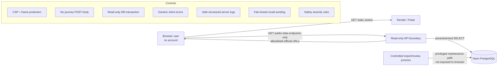

# FixForward Iteration 1 - Secure Architecture

## Security objective

For I1, integrity and safe failure are more important than account confidentiality because there are no accounts. The application must never turn a data outage, manipulated client state or limited recall coverage into false reassurance.

## Trust boundaries and controls

| Boundary | Primary threats | Existing/implemented control | Still to verify/improve |
|---|---|---|---|
| Browser -> API | crafted requests, bypass, XSS | GET-only public data contract, escaped dynamic text, CSP | live endpoint/method tests, dependency scan |
| API -> Neon | injection, excessive privilege, outage | parameterised SQL, read-only transaction, SELECT-only deployment role expected | capture effective grants, connection resilience/pool evidence |
| Imported data -> UI | poisoned/misleading records | curated tables, reviewed recall flag, safe URLs, explicit limitations | checksum/provenance evidence, review workflow evidence |
| Safety/recall decision | false reassurance | no category-level clearance, exact-model matching, recall outage warning, critical/caution split | tamper/bypass tests against deployed build |
| External links | malicious/untrusted redirect | ACCC host allowlist for recall notice URLs, HTTP(S) validation | audit every source/provider URL |
| Hosting/logging | privacy overclaim | UI no longer says infrastructure cannot log; no analytics cookies | confirm Render log retention/access policy for project documentation |

## Safe failure rules

1. Recall endpoint unavailable -> label recall status unknown; continue static safety screening.
2. Location endpoint unavailable -> do not affect recall or repair-evidence availability.
3. Hazardous/uncertain safety result -> never show community Repair Cafe as professional assessment.
4. Near model identifier -> never promote to exact recall match.
5. No location match -> do not invent a provider.
6. No representative price dataset -> do not claim an automatic market benchmark.
