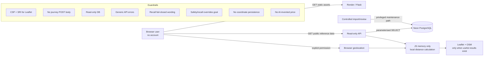

# FixForward Iteration 1 — Secure Architecture (v1.5 human-first prototype)

## Security objective

FixForward has no accounts or payments. The primary security objective is **decision integrity**: an outage, manipulated state, misleading imported record or convenient UX shortcut must never become false safety reassurance.



## Trust boundaries and controls

| Boundary | Threat / failure | Implemented control | Verify before final release |
|---|---|---|---|
| Browser → API | crafted requests, XSS, bypass | GET-only reference API, escaped dynamic text, CSP | live method/route tests; dependency scan |
| API → Neon | injection, excessive privilege, outage | parameterised SQL, read-only transaction/role design | effective grants; timeout/resilience evidence |
| Imported data → UI | stale/poisoned/misleading rows | curated source pipeline, reviewed recall flag, source metadata, call/check-before-travel wording | import checksums, review evidence, refresh tests |
| Goal shortcut → safety gate | user bypasses recall/safety | every direct goal goes through a short gate; serious/uncertain/recall state overrides route | E2E direct-route/bypass tests |
| Safety question UX | UI encourages unsafe inspection | plain-language help explicitly says do not switch on/open/touch/remove screws; Yes/Not sure can stop questions early | observed usability + keyboard/screen-reader checks |
| Device geolocation | privacy leakage | permission only on click; coordinates in JS state only; no coordinate API request/persistence | network/storage inspection |
| External map dependencies | supply chain, privacy, availability | Leaflet 1.9.4 + SRI, CSP allowlist, OSM attribution; map code not loaded until useful result exists; list fallback | CDN failure + request inspection |
| External links | malicious redirect | HTTP(S) validation; official recall host restriction in backend | service/source URL audit |
| Cost intelligence | hallucinated/biased price | no automatic dollar value without governed evidence; AI only proposed for identity resolution | price governance/model evaluation before activation |
| State changes | stale result attached to different appliance | family/category changes clear safety, decision, cost result; model/brand edits invalidate old comparison result | browser Back/edit/re-run tests |
| Hosting/logging | privacy overclaim / sensitive exception detail | UI acknowledges normal hosting/map metadata; no analytics cookies; unexpected API handler logs path + exception class without deliberate traceback attachment | document Render retention/access controls; inspect production logs |

## Geolocation privacy data flow

```text
User clicks "Use my current location"
            ↓
Browser permission dialog
            ↓
latitude/longitude in JS memory
            ↓
Haversine comparison with public service coordinates
            ↓
nearest results
            ↓
map library/tiles load only when there are results worth plotting

NO journey POST → Flask
NO coordinate write → Neon
NO localStorage/cookie/sessionStorage
```

The geolocation feature is a **prototype scope change** because the earlier I1 baseline specified manual suburb selection. The exact coordinate is not sent to FixForward/Neon, but rendering a map causes the browser to request external map resources for the displayed area; this must remain in the privacy review.

## Safe-failure rules

1. Recall endpoint unavailable → explicitly say the check is unavailable; official search remains available; static safety check still works.
2. Location endpoint unavailable → recall/safety/cost logic continues.
3. Map/CDN unavailable → service text list remains usable.
4. Geolocation denied/unavailable → manual suburb/postcode remains usable.
5. A decisive Yes/Not sure → user may stop answering; the UI must not encourage more inspection.
6. Serious safety result → no community Repair Café, no normal cost shortcut and no ordinary recycling listing.
7. Uncertain safety result → no cost/community-repair shortcut. Recycling may show contact-first listings only when there is no possible recall, with a transport caution.
8. Possible recall → official recall instructions take priority.
9. Near model identifier → never promoted to exact recall match.
10. No location match → never invent a provider.
11. Missing phone/hours/acceptance evidence → do not invent it.
12. Weak price data → do not generate an automatic market price.
13. Water/moisture ingress remains a serious stop-use warning under the conservative I1 baseline; not every Yes is identical because heat/power remain caution-level checks.
